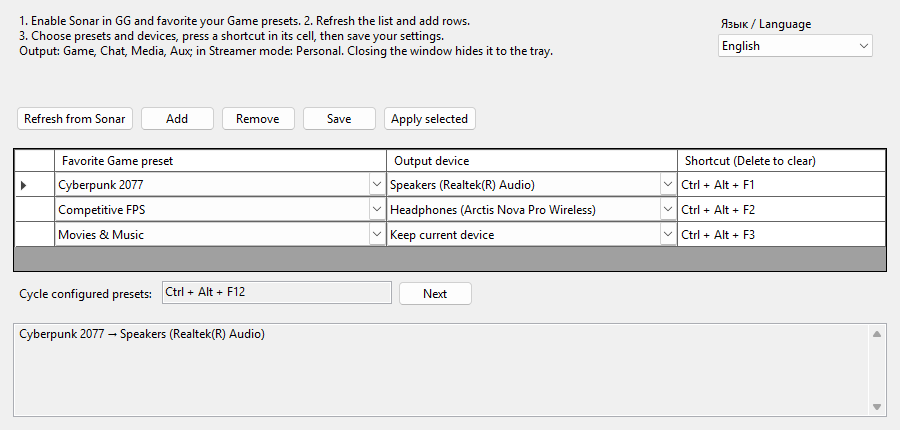

<div align="center">

# SonarHotkeys

**Switch SteelSeries Sonar presets and output devices with global hotkeys.**

[](https://github.com/Ronnybest/SonarHotkeys/releases/latest) [](https://github.com/Ronnybest/SonarHotkeys/releases) [](LICENSE.txt)  

[**Download**](https://github.com/Ronnybest/SonarHotkeys/releases/latest) · [Changelog](CHANGELOG.md) · [Русский](README.ru.md)



</div>

## Why

Changing a Sonar preset and output device together usually means opening GG and clicking through Sonar's settings. SonarHotkeys sits in the tray and does both with a keystroke: press <kbd>Ctrl</kbd>+<kbd>Alt</kbd>+<kbd>F1</kbd> for your game preset on speakers, <kbd>Ctrl</kbd>+<kbd>Alt</kbd>+<kbd>F2</kbd> for your FPS preset on headphones.

## Features

- **One hotkey, preset and output together.** Each binding selects a Game preset and, optionally, a physical output device.
- **Cycle hotkey.** A separate shortcut steps through your configured presets, starting from the one currently selected in GG.
- **Tray menu.** Pick any configured preset without opening the window.
- **Safe switching.** If Sonar rejects part of a change, the previous preset and outputs are restored.
- **English and Russian interface**, switchable at any time.
- **Portable.** One self-contained `.exe`: no installer, no .NET runtime to install.

## Requirements

- Windows 10 or 11, x64
- [SteelSeries GG](https://steelseries.com/gg) with Sonar enabled

## Quick start

1. Download `SonarHotkeys-win-x64.zip` from the [latest release](https://github.com/Ronnybest/SonarHotkeys/releases/latest), extract it anywhere and run `SonarHotkeys.exe`.
2. In GG, mark the **Game** presets you want to use as favorites.
3. In SonarHotkeys, click **Refresh from Sonar**, then **Add** a row for each preset.
4. Choose an output device, or keep **Keep current device** to switch only the preset.
5. Double-click the shortcut cell and press a combination with <kbd>Ctrl</kbd>, <kbd>Alt</kbd> or <kbd>Shift</kbd>. <kbd>Delete</kbd> clears it.
6. Click **Save**. Your hotkeys work immediately, even with the window closed.

**Apply selected** tries a row before you save it. Each preset and each shortcut may appear only once. A row without a shortcut is still available from the tray menu and the cycle hotkey.

## How switching works

| Sonar mode | What changes |
| --- | --- |
| Classic | Output device of the **Game, Chat, Media** and **Aux** channels |
| Streamer | Output device of the **Personal** mix |
| Both | The selected **Game** preset |

SonarHotkeys changes Sonar's routing only; the Windows default output device stays the same, so applications must play through Sonar's virtual devices.

## Tray and startup

Closing the window hides it to the tray. Double-click the tray icon or choose **Settings** to reopen it, and **Exit** to quit. Starting the app again brings up the window of the running instance.

| Argument | Effect |
| --- | --- |
| `--tray` | Start hidden in the tray. Ignored until at least one binding is saved, and in Debug builds. |

To start with Windows, put a shortcut to `SonarHotkeys.exe --tray` into `shell:startup`.

## Settings

Settings are stored per user in `%LOCALAPPDATA%\SonarHotkeys\settings.json`. To update, exit from the tray and replace the `.exe`; your bindings are kept. Preset and device IDs are specific to each computer, so set them up again on a new machine.

A damaged settings file is never overwritten automatically: the app starts with an empty configuration and shows the error. To reset, exit the app and delete the file.

## Troubleshooting

| Problem | Solution |
| --- | --- |
| "GG or Sonar is unavailable" | Start GG, enable Sonar, then click **Refresh from Sonar** |
| No presets in the list | Mark Game presets as favorites in GG and refresh |
| An output device is missing | Connect it, refresh and choose it again |
| "The shortcut is in use" | Another application or Windows owns it; choose a different combination |
| No notifications | Check Windows notification settings and Do Not Disturb |

## Building from source

Requires Windows and the [.NET 10 SDK](https://dotnet.microsoft.com/download/dotnet/10.0).

```powershell
dotnet build SonarHotkeys.slnx -c Release
dotnet run --project tests/SonarHotkeys.Checks/SonarHotkeys.Checks.csproj -c Release
powershell -NoProfile -ExecutionPolicy Bypass -File scripts/Publish.ps1
```

The checks use temporary settings files and never touch your real settings or Sonar routing. `Publish.ps1` produces `artifacts/SonarHotkeys-win-x64.zip` with the executable, documentation and licenses only.

## Contributing

Issues and pull requests are welcome.

Interface texts are written in Russian in the source code, and the Russian text is the translation key. English translations live in [`SonarHotkeys/Translations.json`](SonarHotkeys/Translations.json). When you add or change a text, update that file as well; the checks fail if a translation is missing or unused.

## License

[MIT](LICENSE.txt). Built on [SteelSeries-NET-API](https://github.com/DataNext27/SteelSeries-NET-API); see [third-party notices](THIRD-PARTY-NOTICES.md).

SonarHotkeys is an independent project and is not affiliated with or endorsed by SteelSeries.
