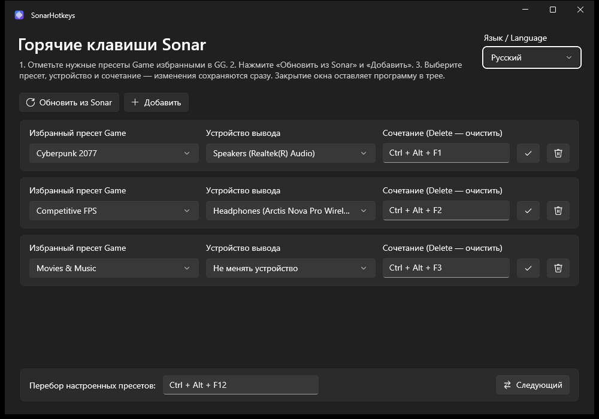

<div align="center">

# SonarHotkeys

**Переключение пресетов и устройств вывода SteelSeries Sonar глобальными горячими клавишами.**

[](https://github.com/Ronnybest/SonarHotkeys/releases/latest) [](https://github.com/Ronnybest/SonarHotkeys/releases) [](LICENSE.txt)  

[**Скачать**](https://github.com/Ronnybest/SonarHotkeys/releases/latest) · [Журнал изменений](CHANGELOG.md) · [English](README.md)



</div>

## Зачем

Чтобы сменить пресет Sonar вместе с устройством вывода, обычно нужно открыть GG и пройтись по настройкам Sonar. SonarHotkeys живёт в трее и делает это одним нажатием: <kbd>Ctrl</kbd>+<kbd>Alt</kbd>+<kbd>F1</kbd> включает игровой пресет на колонках, <kbd>Ctrl</kbd>+<kbd>Alt</kbd>+<kbd>F2</kbd> — пресет для шутеров на наушниках.

## Возможности

- **Пресет и устройство одним сочетанием.** Каждая привязка выбирает пресет Game и, если нужно, физическое устройство вывода.
- **Перебор.** Отдельное сочетание переключает настроенные пресеты по кругу, начиная от выбранного сейчас в GG.
- **Меню в трее.** Любой настроенный пресет можно выбрать, не открывая окно.
- **Безопасное переключение.** Если Sonar не принял часть изменений, прежние пресет и устройства восстанавливаются.
- **Интерфейс на русском и английском**, переключается в любой момент; другие языки добавляются одним файлом.
- **Современный вид Windows.** WinUI 3 с фоном Mica, светлая и тёмная темы следуют настройкам Windows.
- **Портативность.** Распакуйте папку и запустите: без установщика и без отдельной установки .NET или Windows App SDK.

## Требования

- Windows 10 версии 1809 или новее либо Windows 11; x64
- [SteelSeries GG](https://steelseries.com/gg) с включённым Sonar

## Быстрый старт

1. Скачайте `SonarHotkeys-win-x64.zip` из [последнего релиза](https://github.com/Ronnybest/SonarHotkeys/releases/latest), распакуйте папку `SonarHotkeys` в любое место и запустите из неё `SonarHotkeys.exe`.
2. В GG отметьте нужные пресеты канала **Game** как избранные.
3. В SonarHotkeys нажмите **Обновить из Sonar**, затем **Добавить** привязку для каждого пресета.
4. Выберите устройство вывода или оставьте **Не менять устройство**, чтобы переключать только пресет.
5. Щёлкните поле сочетания и нажмите комбинацию с <kbd>Ctrl</kbd>, <kbd>Alt</kbd> или <kbd>Shift</kbd>. <kbd>Delete</kbd> очищает её.
6. Готово: изменения сохраняются сразу. Новое сочетание начинает работать, как только вы выйдете из его поля или переключитесь в другое окно, даже при закрытом окне настроек.

Кнопка ✓ на карточке сразу применяет привязку, чтобы её проверить. Каждый пресет и каждое сочетание встречаются один раз. Привязка без сочетания всё равно доступна из меню в трее и через перебор.

## Как переключается звук

| Режим Sonar | Что меняется |
| --- | --- |
| Classic | Устройство вывода каналов **Game, Chat, Media** и **Aux** |
| Streamer | Устройство вывода микса **Personal** |
| Оба | Выбранный пресет **Game** |

SonarHotkeys меняет только маршрутизацию Sonar; устройство по умолчанию в Windows остаётся прежним, поэтому программы должны выводить звук через виртуальные устройства Sonar.

## Трей и запуск

Закрытие окна прячет его в трей. Щелчок по значку или пункт **Настройки** открывает окно, **Выход** завершает программу. Повторный запуск открывает окно уже работающей копии.

| Аргумент | Действие |
| --- | --- |
| `--tray` | Запуск со скрытым окном. Не действует, пока не сохранена хотя бы одна привязка, и в Debug-сборке. |

Для автозапуска положите ярлык на `SonarHotkeys.exe --tray` в папку `shell:startup`.

## Настройки

Настройки каждого пользователя хранятся в `%LOCALAPPDATA%\SonarHotkeys\settings.json`. Для обновления завершите программу через трей и замените папку `SonarHotkeys` новой; привязки сохранятся, в том числе сохранённые версией 1.x. Идентификаторы пресетов и устройств у каждого компьютера свои, поэтому на новом компьютере привязки нужно настроить заново.

Повреждённый файл настроек не перезаписывается автоматически: программа открывается с пустой конфигурацией и показывает ошибку. Для сброса завершите программу и удалите файл.

## Решение проблем

| Проблема | Решение |
| --- | --- |
| «GG или Sonar недоступен» | Запустите GG, включите Sonar и нажмите **Обновить из Sonar** |
| В списке нет пресетов | Отметьте пресеты Game избранными в GG и обновите список |
| Нет устройства вывода | Подключите его, обновите список и выберите заново |
| «Сочетание занято» | Его заняла другая программа или Windows; выберите другое |
| Нет уведомлений | Проверьте настройки уведомлений Windows и режим «Не беспокоить» |

## Сборка из исходников

Нужны Windows и [.NET 10 SDK](https://dotnet.microsoft.com/download/dotnet/10.0). Архив релиза компилируется через Native AOT, которому нужен ещё компоновщик MSVC: Visual Studio 2026 или её Build Tools с нагрузкой **Разработка классических приложений на C++**.

```powershell
dotnet build SonarHotkeys.slnx -c Release
dotnet run --project tests/SonarHotkeys.Checks/SonarHotkeys.Checks.csproj -c Release
powershell -NoProfile -ExecutionPolicy Bypass -File scripts/Publish.ps1
```

Проверки работают с временными файлами настроек и не трогают ваши настройки и маршрутизацию Sonar. `Publish.ps1` собирает `artifacts/SonarHotkeys-win-x64.zip`, в котором только папка приложения, документация и лицензии.

| Проект | Содержимое |
| --- | --- |
| `SonarHotkeys.Core` | Настройки, разбор сочетаний, переводы и переключение Sonar, без зависимости от интерфейса |
| `SonarHotkeys.WinUI` | Приложение на WinUI 3: окно настроек, значок в трее и глобальные сочетания |
| `tests/SonarHotkeys.Checks` | Проверки библиотеки Core и файлов перевода |

Debug-сборка всегда показывает окно и принимает `--settings=<файл>`, чтобы работать с отдельным файлом настроек, и `--skip-refresh`, чтобы не обращаться к Sonar и использовать сохранённые пресеты.

## Участие в разработке

Issues и pull requests приветствуются.

### Переводы

Тексты интерфейса лежат в [`SonarHotkeys.Core/Strings`](SonarHotkeys.Core/Strings): по одному JSON-файлу на язык со стабильными ключами вроде `Toolbar.Add`. Эталон — английский `en.json`.

Чтобы добавить язык, скопируйте `en.json` в `<код>.json`, где `<код>` — двухбуквенный код языка (например, `de.json`), впишите в `Language.Name` название языка на нём самом и переведите значения. Подстановки вроде `{0}` сохраните. Язык сам появится в меню языков, менять код не нужно. Если для языка Windows есть файл, программа запускается на нём.

Проверки падают, если код использует ключ, которого нет в `en.json`, если в `en.json` есть неиспользуемый ключ, или если в другом языке не хватает ключа или изменены подстановки.

## Лицензия

[MIT](LICENSE.txt). Построено на [SteelSeries-NET-API](https://github.com/DataNext27/SteelSeries-NET-API); см. [сведения о сторонних компонентах](THIRD-PARTY-NOTICES.md).

SonarHotkeys — независимый проект, не связанный со SteelSeries и не одобренный ею.
